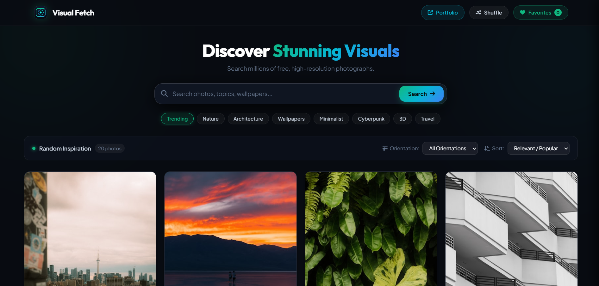

# Visual Fetch 📸

> A sleek, high-performance image discovery and photography platform powered by the Unsplash API.

[](https://visualfetch.netlify.app/)

---

## 🌟 Preview



---

## ⚡ Overview

**Visual Fetch** is a modern, responsive web application that connects with the Unsplash API to explore, discover, and download millions of free, high-resolution photographs. Built with clean vanilla JavaScript, modern CSS flexbox masonry, and a dark glassmorphic design system.

🔗 **Live Demo:** [https://visualfetch.netlify.app/](https://visualfetch.netlify.app/)

---

## ✨ Features

- 🔍 **Instant Search & Autocomplete**: Search millions of high-resolution images by keyword or topic.
- 🧱 **Stable Multi-Column Masonry Grid**: Dynamic responsive gallery that preserves photo aspect ratios with zero layout shifts on pagination.
- 🪟 **HD Lightbox Modal**: Fullscreen image preview with author credits, stats, dimensions, and tags.
- ⬇️ **Multi-Resolution Downloads**: Download photos directly in **Small (640px)**, **Regular (1080px)**, or **Full HD / Original**.
- ❤️ **Saved Favorites Collection & Manager**: Bookmark favorite visuals with `localStorage` persistence, full lightbox preview from drawer, individual quick downloads/removal, and a 1-click **Download All** batch saver.
- 🧭 **Orientation & Sort Filters**: Filter by **Landscape**, **Portrait**, or **Squarish**, and sort by **Popular/Relevant** or **Latest**.
- 🏷️ **Quick Discovery Tags**: One-click curated category chips (*Trending, Nature, Architecture, Wallpapers, Minimalist, Cyberpunk, 3D, Travel*).
- 🔀 **Random Inspiration Shuffle**: Spontaneous discovery mode for finding fresh photographic inspirations.
- 📱 **Fully Responsive**: Seamless layout across mobile, tablet, laptop, and ultra-wide screens.

---

## 🛠️ Tech Stack

- **Frontend Structure**: HTML5 (Semantic & Accessible)
- **Styling & Theme**: Vanilla CSS3 (Custom Properties, Glassmorphism, Responsive Flex Masonry)
- **Application Logic**: Vanilla JavaScript (ES6+, Fetch API, LocalStorage, Async/Await)
- **API Provider**: [Unsplash API](https://unsplash.com/developers)
- **Hosting & Deployment**: [Netlify](https://www.netlify.com/)

---

## 🚀 Getting Started

### Prerequisites
No complex dependencies or build tools needed. A modern web browser is all you need.

### Quick Setup

1. **Clone the repository**:
   ```bash
   git clone https://github.com/shubhamdixit2555/Visual-Fetch.git
   cd Visual-Fetch
   ```

2. **Run locally**:
   - Simply open `index.html` in your browser:
     ```bash
     # On Windows
     start index.html

     # On macOS
     open index.html

     # On Linux
     xdg-open index.html
     ```
   - Or use VS Code **Live Server** extension to launch with local hot-reloading.

---

## 📁 Project Structure

```text
Visual-Fetch/
├── index.html       # Main HTML5 application structure
├── style.css        # Modern design system & responsive masonry styles
├── script.js        # API integration, lightbox, masonry & state logic
├── logo.svg         # Clean geometric camera & viewfinder vector logo
├── screenshot.png   # Application preview screenshot
└── README.md        # Project documentation
```

---

## 👨‍💻 Creator

Crafted with ❤️ by **Shubham Dixit**

- 🌐 **Portfolio**: [https://shubhamdixit.netlify.app/](https://shubhamdixit.netlify.app/)
- 🐙 **GitHub**: [@shubhamdixit2555](https://github.com/shubhamdixit2555)

